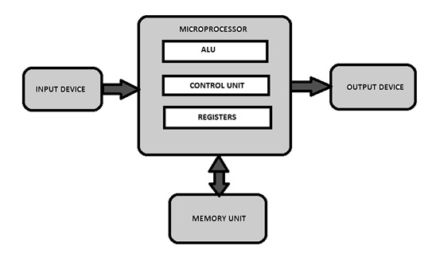
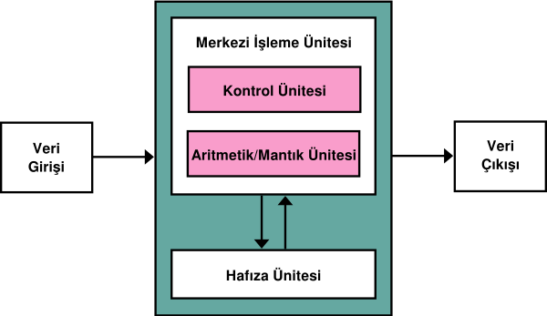
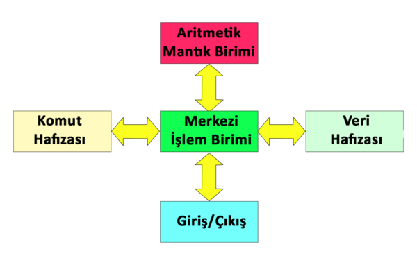

# GÖMÜLÜ SİSTEMLER

## İçindekiler

- [GÖMÜLÜ SİSTEMLER](#gömülü-si̇stemler)
  - [İçindekiler](#i̇çindekiler)
  - [Gömülü Sistem](#gömülü-sistem)
  - [Mikroişlemci](#mikroişlemci)
  - [Mikrodenetleyici](#mikrodenetleyici)
    - [Mikrodenetleyici Mimarileri](#mikrodenetleyici-mimarileri)
      - [Von Neumann Mimarisi](#von-neumann-mimarisi)
      - [Harvard Mimarisi](#harvard-mimarisi)
  - [Mikroişlemci ve Mikrodenetleyici Arasındaki Farklar](#mikroişlemci-ve-mikrodenetleyici-arasındaki-farklar)
  - [Mikrodenetleyici Programlama](#mikrodenetleyici-programlama)
  - [Gömülü Sistem Tasarım Aşamaları](#gömülü-sistem-tasarım-aşamaları)
  - [Kaynaklar](#kaynaklar)

## Gömülü Sistem

Belirli bir işi yapması için tasarlanmış, mikroişlemci veya mikrodenetleyici tabanlı elektronik sistemlerdir.

Kişisel bilgisayar gibi bir bilgisayardan farklı olarak, gömülü bir sistem kendisi için önceden özel olarak tanımlanmış görevleri yerine getirir.

## Mikroişlemci

Yapısında bir 

   - CPU (Central Processing Unit),

   - Ön bellek,

   - I/O (g/ç) birimleri

bulunan entegre devrelere **mikroişlemci** denir. 



[Resim 2.1](https://www.watelectronics.com/what-is-a-microprocessor-architecture-types-its-applications/)

* CPU içerisinde bulunan ALU'da (Arithmetic Logic Unit) aritmetik ve mantık işlemler yapılır. 

* CPU içerisinde bulunan Control Unit'te mantık biriminin, belleğin ve hem giriş hem de çıkış aygıtlarının bir programdan alınan talimatlara nasıl yanıt vereceğini bilmesini sağlar.

* CPU içerisinde bulunan 8-16-32-64 bitlik registerler, bilgilerin geçici sürede depolanmasını sağlarlar.

    - Registerler, işlemcinin çekirdeğinde olduklarından dolayı verilere ulaşmak daha hızlı gerçekleşir. 

    - Kullanım amaçlarına göre genel ve özel çeşitleri vardır.

    - CPU içerisindeki 16 bitlik registerlere PORT adı verilir.

    - Bir PORT'un bir bitine/bacağına PIN adı verilir.

* CPU'lar, mikroişlemcinin hafızasındaki programları bulma, çağırma ve onları çalıştırma görevi görürler.

* Mikroişlemciye atılan veriler ilk olarak hafızaya gelir ve burada depolanır. 

* CPU'ların doğrudan eriştiği birim bellektir. 

* Bellekte iki tane birincil hafıza birimi vardır: RAM ve ROM.

* RAM (Random Access Memory), birincil hafıza birimidir.

    - Rastgele erişim mevcuttur. Rastgele erişim, bir yazaca erişmek istendiğinde sırası ile o yazaca kadar tüm yazaçlara erişmeden direkt erişim biçimidir.

    - Veriler yalnızca akım varlığında depolanır. (Geçici olarak depolanır.)

:warning: RAM'in yapısında bulunan flip-flopların depolama yapabilmesi için saat bilgisi gereklidir. Bu saat bilgisi bir osilatör yardımıyla gerilim varlığında mevcut olabildiğinden ram geçici depolama yapmaktadır.

* ROM (Read Only Memory), kalıcı hafıza birimidir. 

    - İşlemci instructor'larını barındırır.
    
    - Rastgele ve sıralı erişim mevcuttur. Instructorların ilk kısımlarına direkt erişim mevcutken instuctor içerisindeki mikroişlemlere sıralı biçimde erişim mevcuttur.

* CPU'daki veri akışının aktarılmasını, bellek ve i/o birimlerinin bağlantılarını sağlayan 3 çeşit BUS (Veri Yolu) vardır.

    - Address BUS: Adres bilgisi taşıyan BUS'tur.

    - Data BUS: CPU'dan bellek ve I/O portlarına veya bu birimlerden CPU'ya doğru çift yönlü veri aktarımı yapan BUS'tur.

    - Control BUS: Mikroişlemcideki birimler arası iletişimi düzenleyen sinyalleri ileten, kontrol eden veri hattıdır. Her mikroişlemcide farklı sayıda Control BUS bulunabilir.


[Resim 2.2](https://casem3.blogspot.com/2016/08/bus-interconnection.html)

## Mikrodenetleyici

Mikrodenetleyici bir VLSI entegre devre çipinde küçük bir bilgisayar'dır

Mikrodenetleyicinin yapısında 

- CPU,

- RAM,

- ROM,

- I/O Portları,

- Seri ve Paralel Portlar,

- Sayıcılar,

- Osilatör,

- Bazılarında da A/D (Analog to Digital) ve D/A (Digital to Analog) çeviriciler

bulunur.


[Resim 3.1](https://www.circuitbasics.com/wp-content/uploads/2021/09/microcontroller_overview.png)

* Mikrodenetleyici, programlandığı yazılımı hafızasına kaydedip işleyebileceği şekilde derler ve bir çıkış sinyali gönderir.

* Mikrodenetleyiciler, elektronik devrelerde beyin görevi görür, elektronik sistemleri kontrol etmemizi sağlarlar.

* Mikrodenetleyiciler etrafımızdaki çoğu elektronik eşyada bulunmakta ve en çok gömülü sistemlerde kullanılmaktadırlar. 

### Mikrodenetleyici Mimarileri

Mikrodenetleyiciler mimarilerine göre ikiye ayrılmaktadırlar.

#### Von Neumann Mimarisi

Vonn Neumann Mimarisinde işlenecek komutlar ve verilerin bulunduğu RAM birleştirilmiş ve aynı veri yolu ve ortak adresleme üzerinden paylaşılmıştır.

:warning: Birleşik veri yolu nedeniyle, talimatlar ve veriler sırayla bellekten getirilmelidir. Bu darboğaza Von Neumann darboğazı denir.

#### Harvard Mimarisi

Harvard Mimarisinde işlenecek komutlar ve verilerin bulunduğu RAM ayrıdır ve ayrı veri yolları kullanılır.

| Von Neumann Mimarisi | Harvard Mimarisi |
|---|---|
|  |  |
| [Resim 3.2](https://tr.wikipedia.org/wiki/Neumann_mimarisi) | [Resim 3.3](https://tr.wikipedia.org/wiki/Harvard_mimarisi) |

## Mikroişlemci ve Mikrodenetleyici Arasındaki Farklar

* Gerçek zamanlı işlemlerde mikrodenetleyici daha iyi performans gösterir.

* Mikrodenetleyici içerisinde mikroişlemciyi barındırır.

* Mikrodenetleyiciler daha az enerji harcar.

* Mikrodenetleyiciler, mikroişlemcilerden daha küçük boyutlardadırlar.

* Mikroişlemciler ek birimlere ihtiyaç duyduklarından maliyeti daha ağırdır.

* Mikroişlemciler aynı anda çoklu işlem yapabilirken mikrodenetleyiciler tek bir iş yapabilmektedir.

## Mikrodenetleyici Programlama

Mikrodenetleyicilerin yapısında bulunan CPU sayesinde, programlanabilir yapıdadırlar. Bu programlama işlemi için komut satırlarından oluşan bir yazılıma ihtiyaç vardır. 

* Her mikrodenetleyici için farklı derleyici ve kod aktarımı için farklı programlar mevcuttur.

* Mikrodenetleyicilerin programlanabilmesi için programlayıcı bir karta veya programlama yapan bir programa ihtiyaç duyulur. 

* Mikrodenetleyicilere derlenen kodun hex dosyaları -yani makina diline çevrilmiş dosyalar- yüklenir.

* Mikrodenetleyici ve mikroişlemcilerde işlem tek sseferde bitirilemeyeceği için işlemci frekansına bağlı işletilecek bir sonsuz döngü kullanılır. 

```c
// Aşağıda sonsuz döngü içerisinde sürekli 
// kontrolle çalışacak bir programın pseudo 
// kodu bulunmaktadır.
int main(){
    int a, b, c;
    while(1){
        a = read(11);
        if(a<512)
            out(12, HIGH);
        else
            out(12, LOW);
    }
}
```
```c
// Aşağıda sonsuz döngü içerisinde sensör
// uyarımı geldiğinde çalışacak bir kesme
// fonksiyonu 
int main(){
    while(1){
        interrupt.enable();
    }
}

interrupt dur(){
    a = read(11);
    .
    .
    .
}
```

## Gömülü Sistem Tasarım Aşamaları

:warning: Gömülü Sistemlerde her zaman en çok özelliğe sahip mikrokontrolcü ya da mikroişlemcinin kullanılması ya da kompleks komponentlerin kullanılması gerekmez. Asıl amaç işin görülmesi ve az maliyettir. Komponent seçimlerinde gömülü sistemin sabit bir işlemi yapacağı unutulmamalıdır.

1. Tasarlanacak sistemde ihtiyaç duyulan komponentler belirlenir. 

2. Tasarlanacak istemin kağıt üzerinde taslağı oluştulur. Teorik sistem hazırdır.

3. Hazırlanmış teorik sistem, programlar yardımı ile simüle edilir.

4. Sistemin giriş ve çıkış birimleri tamamlanır.

5. Algoritma çıkartılır.

6. Kodlama yapılır.

7. Debug yapılır.

8. Sabit veriler girilip hesaplamalar yapılır.

9. Devre breadboard üzerinde taslak olarak kurulur.

10. Entegreler ve mikrodenetleyiciler bağlanmadan önce gerilim kontrolü yapılır.

11. Derlenen .hex kod mikrodenetleyiciye yüklenir ve devre test edilir.

12. Testleri tamamlanan devre kurulur ve sistem tamamlanır.

## Kaynaklar

1. Doç. Dr. Halil Nusret Buluş, Gömülü Sistemler Ders Notları

2. <https://tr.wikipedia.org/wiki/Gömülü_sistem>

3. <https://www.computerhope.com/jargon/c/contunit.htm>

4. <https://tr.wikipedia.org/wiki/Mikrodenetleyici>

5. Resim 2.1: <https://www.watelectronics.com/what-is-a-microprocessor-architecture-types-its-applications/>

6. Resim 2.2: <https://casem3.blogspot.com/2016/08/bus-interconnection.html>

7. Resim 3.1: <https://www.circuitbasics.com/wp-content/uploads/2021/09/microcontroller_overview.png>

8. Resim 3.2: <https://tr.wikipedia.org/wiki/Neumann_mimarisi>

9. Resim 3.3: <https://tr.wikipedia.org/wiki/Harvard_mimarisi>